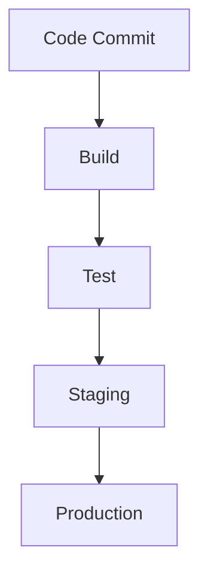

# CI/CD and Jenkins 

## 1. What is CI? Benefits?

### **Continuous Integration (CI)**:
Continuous Integration is a development practice where developers frequently integrate code into a shared repository, typically multiple times a day. Automated build and testing processes are triggered after each integration to detect any issues or bugs early in the development cycle.

### **Benefits of CI**:
- **Early Detection of Issues**: Frequent integration ensures that bugs are caught early and resolved quickly.
- **Reduced Integration Problems**: CI helps eliminate long and painful integration phases at the end of projects.
- **Faster Feedback**: Developers receive instant feedback from automated tests, allowing quicker resolution of issues.
- **Improved Code Quality**: By testing more often, developers can maintain higher code quality.
- **Collaboration**: Developers work more cohesively and merge code changes regularly, promoting teamwork and communication.

---

## 2. What is CD? Benefits?

### **Continuous Delivery (CD)**:
Continuous Delivery is an extension of Continuous Integration, where the goal is to ensure that the code is always in a deployable state. With CD, every change that passes the automated tests is automatically deployed to a staging environment.

### **Benefits of CD**:
- **Faster Releases**: CD allows for faster and more frequent deployments, improving the time-to-market for new features.
- **Improved Software Quality**: With automated testing and regular deployment, code quality remains consistently high.
- **Lower Risk**: Small, frequent releases reduce the risk of bugs and allow for quicker identification of issues.
- **Reduced Manual Work**: Automation decreases the manual effort involved in releasing code, reducing the chances of human error.

---

## 3. Difference between CD and CDE

### **Continuous Delivery (CD)**:
Continuous Delivery ensures that the codebase is always in a deployable state. The process ends with the deployment of the code to a staging environment, requiring manual approval or steps for production deployment.

### **Continuous Deployment (CDE)**:
Continuous Deployment goes a step further than CD. In CDE, code is automatically deployed to production without any manual intervention. Every change that passes the testing pipeline is deployed live.

### **Key Difference**:
- CD stops short of automatic deployment to production, allowing for manual review.
- CDE fully automates deployment to production, removing any manual process.

---

## 4. What is Jenkins?

Jenkins is an open-source automation server widely used for implementing CI/CD workflows. It helps automate the building, testing, and deploying of applications by integrating various development lifecycle tools.

---

## 5. Why use Jenkins? Benefits of using Jenkins? Disadvantages?

### **Why Use Jenkins?**:
Jenkins automates repetitive tasks in the software development process, making it easier to build, test, and deploy code quickly and frequently.

### **Benefits of Using Jenkins**:
- **Open-Source**: Jenkins is free and supported by a large community.
- **Extensible**: Jenkins has a rich ecosystem of plugins that support different integrations (version control systems, build tools, etc.).
- **Automated Builds**: Automatically triggers builds and tests after every code change.
- **Scalable**: Supports distributed builds across multiple machines to speed up complex workflows.
- **Integration**: Can integrate with most popular tools and technologies, making it versatile for various projects.

### **Disadvantages of Jenkins**:
- **Complex Setup**: Jenkins can be complex to set up and configure, especially for large projects.
- **Maintenance**: Regular plugin updates and server maintenance are required.
- **Performance Issues**: Jenkins may suffer from performance issues when running multiple jobs concurrently or under heavy load.
- **UI/UX Limitations**: Jenkins has a somewhat outdated user interface compared to newer CI/CD tools.

---

## 6. Stages of Jenkins

The typical stages in a Jenkins CI/CD pipeline include:
1. **Build**: The source code is compiled, and binaries or artifacts are generated.
2. **Test**: Automated tests are run to verify the functionality and quality of the code.
3. **Deploy**: The tested code is deployed to a staging or production environment.
4. **Monitor**: The deployed application is monitored to track performance and errors in real-time.

---

## 7. What alternatives are there for Jenkins?

Some popular Jenkins alternatives include:
- **GitLab CI/CD**: Integrated CI/CD functionality within GitLab, offering version control and pipelines in one platform.
- **CircleCI**: A cloud-based CI/CD tool focused on simplicity and fast builds.
- **Travis CI**: A CI/CD service used to build and test projects hosted on GitHub.
- **TeamCity**: A CI/CD tool from JetBrains that provides advanced build configuration and pipeline management.
- **Bamboo**: A CI/CD server from Atlassian that integrates well with Jira and Bitbucket.

---

## 8. Why build a pipeline? Business value?

### **Why Build a CI/CD Pipeline?**:
A CI/CD pipeline automates the processes of code building, testing, and deployment, ensuring faster, more reliable software delivery.

### **Business Value**:
- **Speed**: Shortens the time-to-market by delivering updates more quickly.
- **Consistency**: Ensures consistent quality by running automated tests and deployments.
- **Scalability**: Makes it easier to manage large teams and complex codebases by automating repetitive tasks.
- **Risk Mitigation**: Reduces the risk of introducing bugs into production through early detection during testing.

---

## 9. General Diagram of CI/CD

Below is a general diagram of a CI/CD pipeline:

## 10. Understand SDLC Workflow: Plan, Design, Develop, Deploy
Plan:
This is the initial stage where the requirements are gathered, and a project plan is created. Key stakeholders define the objectives and scope of the software.

Design:
In this stage, the software architecture and design specifications are created. The design should meet the requirements outlined in the planning phase.

Develop:
The actual coding happens in this phase. Developers write the code, and the application is built according to the design.

Deploy:
The completed application is deployed to a production environment, making it accessible to users. This stage involves releasing, monitoring, and supporting the software post-deployment.