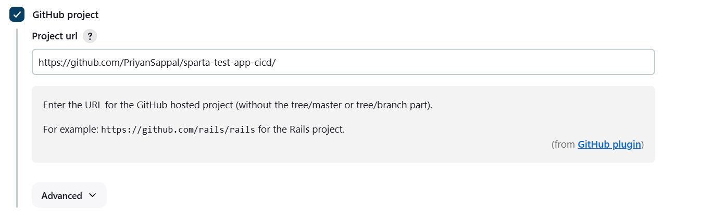
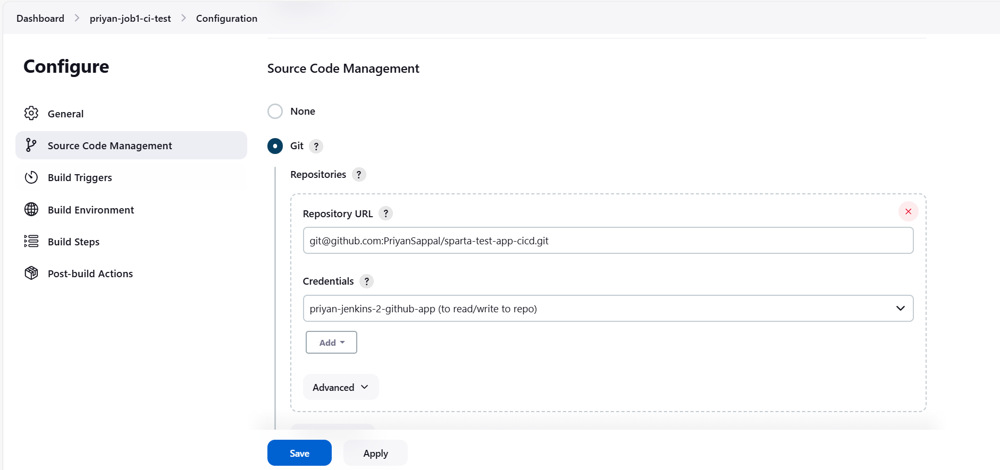

# CI/CD and Jenkins 

- [CI/CD and Jenkins](#cicd-and-jenkins)
  - [1. What is CI? Benefits?](#1-what-is-ci-benefits)
    - [**Continuous Integration (CI)**:](#continuous-integration-ci)
    - [**Benefits of CI**:](#benefits-of-ci)
  - [2. What is CD? Benefits?](#2-what-is-cd-benefits)
    - [**Continuous Delivery (CD)**:](#continuous-delivery-cd)
    - [**Benefits of CD**:](#benefits-of-cd)
  - [3. Difference between CD and CDE](#3-difference-between-cd-and-cde)
    - [**Continuous Delivery (CD)**:](#continuous-delivery-cd-1)
    - [**Continuous Deployment (CDE)**:](#continuous-deployment-cde)
    - [**Key Difference**:](#key-difference)
  - [4. What is Jenkins?](#4-what-is-jenkins)
  - [5. Why use Jenkins? Benefits of using Jenkins? Disadvantages?](#5-why-use-jenkins-benefits-of-using-jenkins-disadvantages)
    - [**Why Use Jenkins?**:](#why-use-jenkins)
    - [**Benefits of Using Jenkins**:](#benefits-of-using-jenkins)
    - [**Disadvantages of Jenkins**:](#disadvantages-of-jenkins)
  - [6. Stages of Jenkins](#6-stages-of-jenkins)
  - [7. What alternatives are there for Jenkins?](#7-what-alternatives-are-there-for-jenkins)
  - [8. Why build a pipeline? Business value?](#8-why-build-a-pipeline-business-value)
    - [**Why Build a CI/CD Pipeline?**:](#why-build-a-cicd-pipeline)
    - [**Business Value**:](#business-value)
  - [9. General Diagram of CI/CD](#9-general-diagram-of-cicd)
  - [10. Understand SDLC Workflow: Plan, Design, Develop, Deploy](#10-understand-sdlc-workflow-plan-design-develop-deploy)
  - [Demo from trainer - notes](#demo-from-trainer---notes)
  - [Diagram of CI/CD](#diagram-of-cicd)
  - [Access your Jenkins server](#access-your-jenkins-server)
  - [Make your mini pipeline (a job)](#make-your-mini-pipeline-a-job)
  - [To get jobs to run on after another](#to-get-jobs-to-run-on-after-another)
  - [Diagram of Jenkins with 3 Jobs](#diagram-of-jenkins-with-3-jobs)
  - [Steps for Jenkins for 3 Jobs](#steps-for-jenkins-for-3-jobs)
    - [1. Create SSH key pair](#1-create-ssh-key-pair)
    - [2. Make Sparta app repo on GitHub](#2-make-sparta-app-repo-on-github)
    - [3. Add the public key to the GitHub repo](#3-add-the-public-key-to-the-github-repo)
    - [4. Add a new job (Job 1) in Jenkins from the dashboard](#4-add-a-new-job-job-1-in-jenkins-from-the-dashboard)
    - [5. Setup Webhook on GitHub](#5-setup-webhook-on-github)
    - [6. Add a new job (Job 2) in Jenkins from the dashboard](#6-add-a-new-job-job-2-in-jenkins-from-the-dashboard)
    - [7. Add a new job (Job 3) in Jenkins from the dashboard](#7-add-a-new-job-job-3-in-jenkins-from-the-dashboard)
    - [8. Potential Blockers](#8-potential-blockers)

## 1. What is CI? Benefits?

### **Continuous Integration (CI)**:
Continuous Integration is a development practice where developers frequently integrate code into a shared repository, typically multiple times a day. Automated build and testing processes are triggered after each integration to detect any issues or bugs early in the development cycle.

### **Benefits of CI**:
- **Early Detection of Issues**: Frequent integration ensures that bugs are caught early and resolved quickly.
- **Reduced Integration Problems**: CI helps eliminate long and painful integration phases at the end of projects.
- **Faster Feedback**: Developers receive instant feedback from automated tests, allowing quicker resolution of issues.
- **Improved Code Quality**: By testing more often, developers can maintain higher code quality.
- **Collaboration**: Developers work more cohesively and merge code changes regularly, promoting teamwork and communication.

---

## 2. What is CD? Benefits?

### **Continuous Delivery (CD)**:
Continuous Delivery is an extension of Continuous Integration, where the goal is to ensure that the code is always in a deployable state. With CD, every change that passes the automated tests is automatically deployed to a staging environment.

### **Benefits of CD**:
- **Faster Releases**: CD allows for faster and more frequent deployments, improving the time-to-market for new features.
- **Improved Software Quality**: With automated testing and regular deployment, code quality remains consistently high.
- **Lower Risk**: Small, frequent releases reduce the risk of bugs and allow for quicker identification of issues.
- **Reduced Manual Work**: Automation decreases the manual effort involved in releasing code, reducing the chances of human error.

---

## 3. Difference between CD and CDE

### **Continuous Delivery (CD)**:
Continuous Delivery ensures that the codebase is always in a deployable state. The process ends with the deployment of the code to a staging environment, requiring manual approval or steps for production deployment.

### **Continuous Deployment (CDE)**:
Continuous Deployment goes a step further than CD. In CDE, code is automatically deployed to production without any manual intervention. Every change that passes the testing pipeline is deployed live.

### **Key Difference**:
- CD stops short of automatic deployment to production, allowing for manual review.
- CDE fully automates deployment to production, removing any manual process.

---

## 4. What is Jenkins?

Jenkins is an open-source automation server widely used for implementing CI/CD workflows. It helps automate the building, testing, and deploying of applications by integrating various development lifecycle tools.

---

## 5. Why use Jenkins? Benefits of using Jenkins? Disadvantages?

### **Why Use Jenkins?**:
Jenkins automates repetitive tasks in the software development process, making it easier to build, test, and deploy code quickly and frequently.

### **Benefits of Using Jenkins**:
- **Open-Source**: Jenkins is free and supported by a large community.
- **Extensible**: Jenkins has a rich ecosystem of plugins that support different integrations (version control systems, build tools, etc.).
- **Automated Builds**: Automatically triggers builds and tests after every code change.
- **Scalable**: Supports distributed builds across multiple machines to speed up complex workflows.
- **Integration**: Can integrate with most popular tools and technologies, making it versatile for various projects.

### **Disadvantages of Jenkins**:
- **Complex Setup**: Jenkins can be complex to set up and configure, especially for large projects.
- **Maintenance**: Jenkins is self-hosted. Regular plugin updates and server maintenance are required.
- **Performance Issues**: Jenkins may suffer from performance issues when running multiple jobs concurrently or under heavy load.
- **UI/UX Limitations**: Jenkins has a somewhat outdated user interface compared to newer CI/CD tools.

---

## 6. Stages of Jenkins

The typical stages in a Jenkins CI/CD pipeline include:
1. **Build**: The source code is compiled, and binaries or artifacts are generated.
2. **Test**: Automated tests are run to verify the functionality and quality of the code.
3. **Deploy**: The tested code is deployed to a staging or production environment.
4. **Monitor**: The deployed application is monitored to track performance and errors in real-time.

---

## 7. What alternatives are there for Jenkins?

Some popular Jenkins alternatives include:
- **GitLab CI/CD**: Integrated CI/CD functionality within GitLab, offering version control and pipelines in one platform.
- **CircleCI**: A cloud-based CI/CD tool focused on simplicity and fast builds.
- **Travis CI**: A CI/CD service used to build and test projects hosted on GitHub.
- **TeamCity**: A CI/CD tool from JetBrains that provides advanced build configuration and pipeline management.
- **Bamboo**: A CI/CD server from Atlassian that integrates well with Jira and Bitbucket.

---

## 8. Why build a pipeline? Business value?

### **Why Build a CI/CD Pipeline?**:
A CI/CD pipeline automates the processes of code building, testing, and deployment, ensuring faster, more reliable software delivery.

### **Business Value**:
- **Speed**: Shortens the time-to-market by delivering updates more quickly.
- **Consistency**: Ensures consistent quality by running automated tests and deployments.
- **Scalability**: Makes it easier to manage large teams and complex codebases by automating repetitive tasks.
- **Risk Mitigation**: Reduces the risk of introducing bugs into production through early detection during testing.

---

## 9. General Diagram of CI/CD

Below is a general diagram of a CI/CD pipeline:


## 10. Understand SDLC Workflow: Plan, Design, Develop, Deploy
* Plan:
This is the initial stage where the requirements are gathered, and a project plan is created. Key stakeholders define the objectives and scope of the software.

* Design:
In this stage, the software architecture and design specifications are created. The design should meet the requirements outlined in the planning phase.

* Develop:
The actual coding happens in this phase. Developers write the code, and the application is built according to the design.

* Deploy:
The completed application is deployed to a production environment, making it accessible to users. This stage involves releasing, monitoring, and supporting the software post-deployment.

## Demo from trainer - notes
* Pushed changes from Git Bash that will trigger the pipeline within jenkins (within this it will test and check the code and actually use this to change the website) and that will make a new EC2 instance on AWS which will incorporate the changes. 

## Diagram of CI/CD


---
## Access your Jenkins server
- Priyan in server 2
- Check .ssh repo for Credentials
 
## Make your mini pipeline (a job)
1. Select "new item" in the left hand side
2. name it (as only tech264 are using these server you can exclude that part)
3. select freestyle
4. Everytime the pipeline runs it saves it as a "build"
5. we want to keep a max of 5 and discard old builds
6. scroll down to build steps
7. select execute shell
8. add the ```uname -a``` command
9. when you're done:
   1.  go to dashboard
   2.  click build history and click the number
   3.  click the console output and you can see the command you've run and the output
10. when the worker node (that runs the jobs) has run the job, the node stays for 10 minutes
 
## To get jobs to run on after another
1. go back to dashboard
2. click the first job you want to run
3. go to configure on the left hand side
4. scroll to the bottom to "post-build actions"
5. select build other projects
6. choose your next project (can add multiple)
7. select trigger only if build is stable
8. save
9. click build now
10. in the console output you should be able to see that it has triggered the next build
11. and if you go to the console output of the triggered build, it should say it was started by an upstream project

## Diagram of Jenkins with 3 Jobs


* Need a key pair for Job 2 (SSH). For the merge. 
* **Within the diagram above**, we would need an AWS EC2 instance that is already running.
* Therefore, Jenkins would need to authenticate with the private key (e.g, pem file) for  Job 3: to SSH into and deploy the code. 
* All the dependencies for the app to run needs to be installed and configured. 

* In Jenkins, polling refers to the process where Jenkins regularly checks a version control system (such as Git) for changes in the code repository. If changes (commits) are detected, Jenkins triggers a build automatically.

## Steps for Jenkins for 3 Jobs

### 1. Create SSH key pair
* Generate key pair within your `.ssh` directory. Give Jenkins the private key and give GitHub the public key. 

### 2. Make Sparta app repo on GitHub
1. Create remote repo on GitHub.
2. **`git clone`** the repo onto local machine
3. Add the Sparta app file located in downloads. 
4. You can then **`add`**, **`commit`** and **`push`** these changes. 

### 3. Add the public key to the GitHub repo
1. Go to the repo and click the settings for that specific repo. 
2. Locate the **Deploy Keys**.
3. Use the `cat` command to print the public key and input that into the key. 

### 4. Add a new job (Job 1) in Jenkins from the dashboard
1. Name it and choose **freestyle project**. 
2. Enable Github Project.
3. Enter the **HTTPS link** for the **repository** you wish to link.
4. Fill in as follows: 


Make sure you remove the `.git`.

**Source Code Management**
   1. select **Git** and enter your **SSH** repository link.
   2. Add your credentials.
   3. For the **Kind** section, select **SSH Username with private key**.
   4. In **ID**, name it the same as the key.
   5. In description, write what the key is going to be used for.
   6. In the **Username** section, Ppaste the **ID** we just used.
   7. Under **Private Key**, Enable **Enter directly** and input your private key.
1. Click **Add**.
2. Now, under the **credentials**, you can select the key you've added.
3. Below that, under **Branches to build**, change it to `*/main`. Later, this'll be `dev`.
4. Build Environment: Enable **Provide node and npm bin/ folder to PATH** and specify **NodeJS version 20**. We do this so we can run nodejs and npm commands.
5. Add an **execute shell** build step, and insert the following commands:
 
``` bash
  cd app
  npm install
  npm test
```

10.  On the job screen:
     1. Select **Build now** and await your evil machine's birth!!! You might have to do some waiting.
     2.  You can view the job by clicking the link to it under **build history**.
     3.  Click **Console Output** and you'll see it working in real time if it hasn't finished yet.

### 5. Setup Webhook on GitHub
1. On this you want to add the link to Jenkins website and add `github-webhook/`. Now to actually let Jenkins communicate with GitHub you need to select a setting on Jenkins when creating Job 1. Once it is in the pipeline for Job 1 this setting does not need to be specified elsewhere.  


### 6. Add a new job (Job 2) in Jenkins from the dashboard
1. Take the exact same steps as Step 4.
2. On GitHub you want to enable pull request and follow the steps.
3. You want to execute git commands when you **Execute Shell** so that Job 2 does it's job of merging the dev branch with the main branch. This goes in the box:
```bash
git switch main
git merge origin/dev
git push origin main
```
1. Add **SSH Agent**  and select the SSH key that was made for GitHub under **Build Environment**. 
2. Or, instead of the script:


  * Points to note:
    * Should not choose *Force Push*
    * Branch to push should be `main` instead of `dev` in the picture. 

### 7. Add a new job (Job 3) in Jenkins from the dashboard
* You can still follow the steps as in Job 1, but make the following changes:
* You need to add your AWS key that was created and added into your `.ssh` directory. 
* Under Source Code Management:
    * Make sure it is the `*/dev` branch for bracnches to build. 
* You would need to `cat` the `.pem` file and paste it in the **SSH AGENT** in Jenkins - this would be under credentials and you would choose SSH key for your AWS key to be added. This makes the script easier to write. 
* Add the script as follows, the `rsync` command will copy the app stored in Jenkins and copy to the home directory of the ec2 instance with the updated code: 
```bash
rsync -avz -e "ssh -o StrictHostKeyChecking=no" app ubuntu@34.246.172.19:~
ssh -o StrictHostKeyChecking=no ubuntu@34.246.172.19 <<EOF
    pm2 stop all
    cd app
    npm install
    pm2 start app.js
EOF
```
### 8. Potential Blockers
* Try restarting the EC2 instance to ensure it is working and then you will have to SSH into it and restart the app using `pm2`. 
* No user input: `StrictHostKeyChecking=no`. 
* Simplicity is key - having the the app being copied over to your home directory and using `~` to specify this. 
* The setting under **Build Triggers** you will only need the GitHub hook trigger for GITScm polling in Job 1 and it will listen throughout the pipeline. 

  